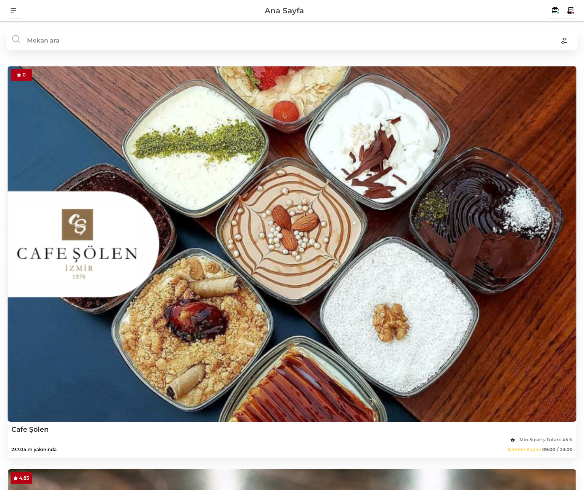

# Nearby Restaurants

Nearby Restaurants is an Ionic Angular mobile application that allows users to search and view nearby restaurants. The application uses geolocation to fetch the user's location and displays a list of nearby restaurants along with their respective details.



You can visit the app's website: <https://nearby-restaurants-edf2f.web.app/home>

## Features

- Fetches user's location using Capacitor Geolocation plugin
- Displays a list of nearby restaurants
- Filters restaurants by name or keyword
- Supports infinite scrolling for better performance
- Displays each restaurant's details in a card component

## Installation

To get started with Nearby Restaurants, follow these steps:

1. Clone the repository:

   ```bash
   git clone https://github.com/abgnydn/nearby-restaurants.git
   ```

2. Navigate to the project directory:

   ```bash
   cd nearby-restaurants
   ```

3. Install the required dependencies:

   ```bash
   npm install
   ```

4. Run the application in your browser:

   ```bash
   ionic serve
   ```

5. Run the application in your emulator:

   ```bash
      ionic capacitor open ios
      ionic capacitor open android
   ```

## Building for Production

To build the application for production, run the following command:

```bash
   ionic build
```

This command will generate a www folder in your project directory, which can be used to deploy the application.

## Contributing

Contributions are welcome! If you find a bug, have a feature request, or want to improve the project, please feel free to create an issue or submit a pull request.

## License

This project is licensed under the MIT License.
